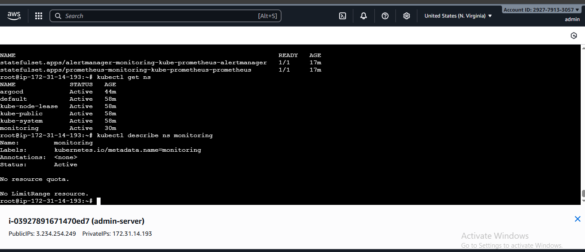
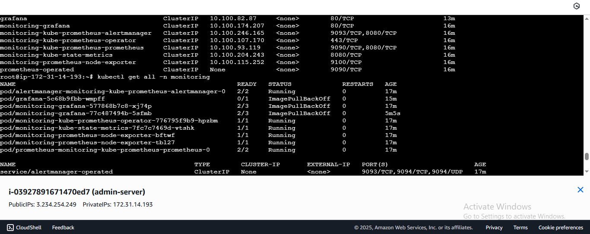
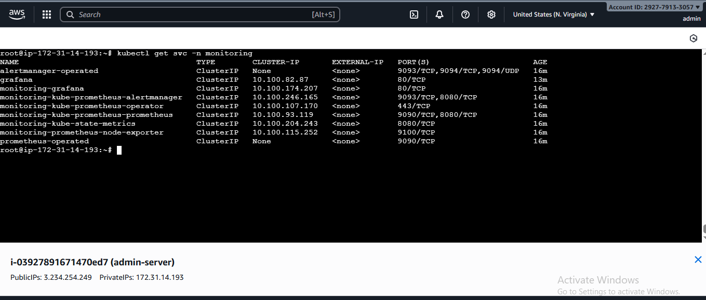
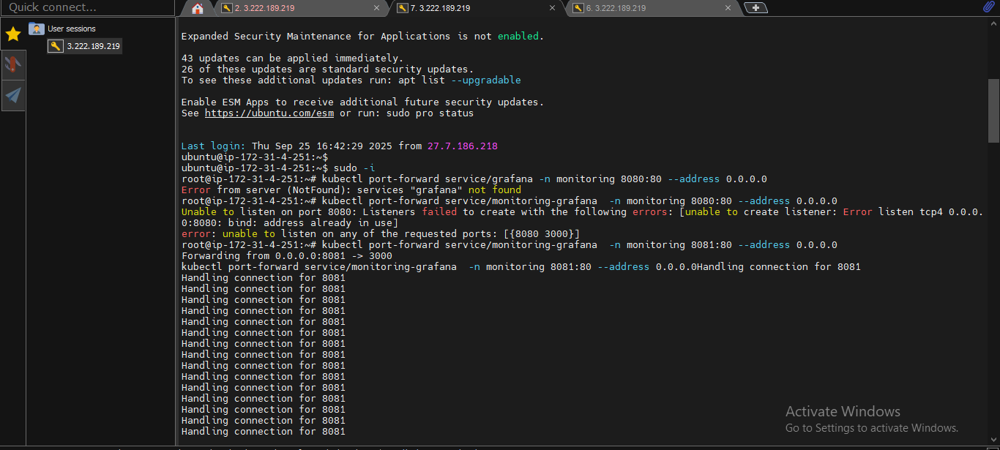

# Monitoring Stack Setup on AWS EKS

This guide details the steps to install and access Prometheus and Grafana on an AWS EKS cluster using Helm charts.

---

## Step 1: Add Helm Repositories and Update

```bash
helm repo add prometheus-community https://prometheus-community.github.io/helm-charts
helm repo add grafana https://grafana.github.io/helm-charts
helm repo update
```


---

## Step 2: Create Monitoring Namespace

```bash
kubectl create namespace monitoring
```



---
## Step 3 : Install Helm 
```bash
curl -fsSL -o get_helm.sh https://raw.githubusercontent.com/helm/helm/main/scripts/get-helm-3
chmod 700 get_helm.sh
./get_helm.sh
```

## Step 4: Install Prometheus Stack and Grafana in Monitoring Namespace

```bash
helm install monitoring prometheus-community/kube-prometheus-stack -n monitoring ./custom_kube_prometheus_stack.yml
```



---

## Step 5: Verify Running Resources and Services

```bash
kubectl get all -n monitoring
kubectl get svc -n monitoring
```



---

## Step 6: Access Prometheus and Grafana UIs via Port Forward

Prometheus:

```bash
kubectl port-forward service/prometheus-operated -n monitoring 9090:9090 --address 0.0.0.0
```


Grafana:

```bash
kubectl port-forward service/monitoring-grafana  -n monitoring 8081:80 --address 0.0.0.0
```

---

## Step 7: Access Prometheus via Public IP of Admin-Server

1. **Access Prometheus UI**  
   Open the following URL in your browser:  
   ```bash
   http://<public-IP>:9090
   ```
Replace <public-IP> with the public IP address of your admin server.
2. **Access Grafana UI**
   Open the following URL in your browser:
   ```bash
   http://<public-IP>:8081
   ```
3. **Retrieve Grafana Admin Password**
   Run the following command to get the admin password from the Kubernetes secret:
   ```bash
   kubectl get secret --namespace monitoring grafana -o jsonpath="{.data.admin-password}" | base64 --decode; echo
   ```
Note: If you installed Grafana using the Prometheus Operator chart, the default admin password is usually:
   ```txt
   prom-operator
   ```
4. **Login to Grafana**
   - Username: admin (or as retrieved from the secret)
   - Password: Use the password you retrieved above
 
---
