# complete-cicd-project

This repository demonstrates a **complete CI/CD pipeline** for a Java application using:
- **Jenkins** for CI/CD
- **Docker** for containerization
- **SonarQube** for static code analysis
- **ArgoCD** for GitOps-based deployment
- **Kubernetes** for container orchestration

---

# Architecture for application
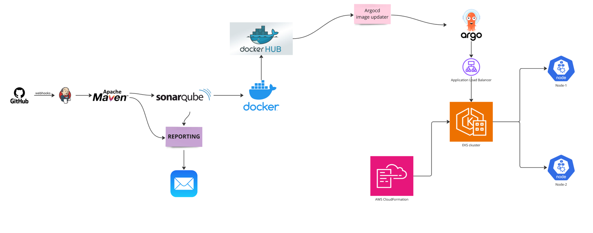

# Infrastructure Setup

Create a EC2 instance via terraform or we can do manually also 

### Security groups inbound list
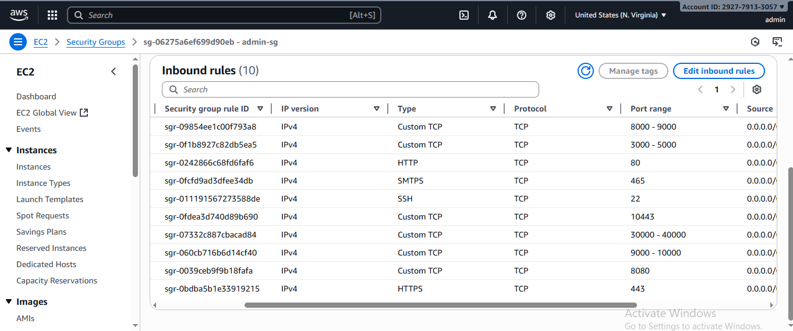

## Create Admin EC2 Instance
```yaml
provider "aws" {
    region = "us-east-1"
    access_key = "xxx"
    secret_key = "xx"
}

resource "aws_instance" "admin" {
    ami = "ami-04b4f1a9cf54c11d0"
    instance_type = "t2.large"
    security_groups = [ "default" ]
    key_name = "project"
    root_block_device {
      volume_size = 30
      volume_type = "gp2"
      delete_on_termination = true
    }
    tags = {
      Name = "Admin-server"
    }

}

output "PublicIP" {
    value =  aws_instance.admin.public_ip
}
```
### terraform commands:
```commandline
terraform init
```
```commandline
terraform plan
```
```commandline
terraform apply
```
```commandline
terraform destroy
```

## Installing the jenkins and Maven:
ref: https://www.jenkins.io/doc/book/installing/linux/#debianubuntu
```yaml
#!/bin/bash
sudo apt update
sudo apt install fontconfig openjdk-17-jre -y
sudo apt install maven -y 
sudo wget -O /etc/apt/keyrings/jenkins-keyring.asc \
  https://pkg.jenkins.io/debian/jenkins.io-2023.key
echo "deb [signed-by=/etc/apt/keyrings/jenkins-keyring.asc]" \
  https://pkg.jenkins.io/debian binary/ | sudo tee \
  /etc/apt/sources.list.d/jenkins.list > /dev/null
sudo apt-get update
sudo apt-get install jenkins -y 
```
```sh
sh mvn-jenkins.sh
```

## To verify the jenkins status

```commandline
systemctl enable jenkins
systemctl start jenkins
systemctl status jenkins
```
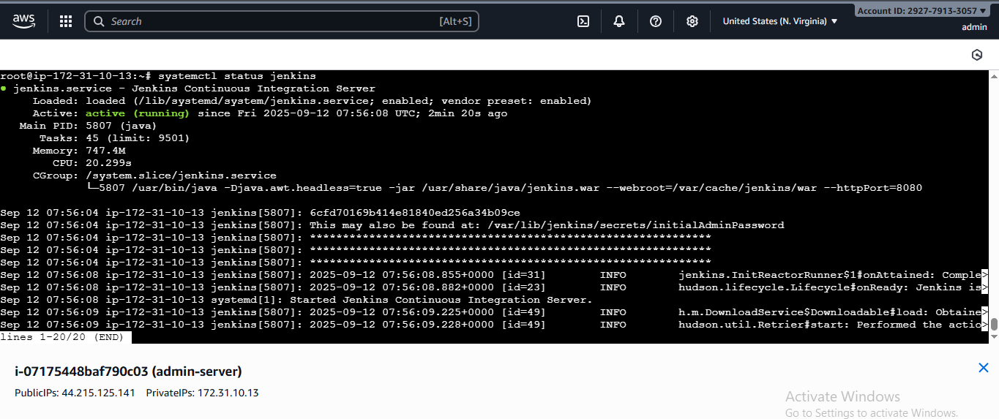

```commandline
mvn --version
```
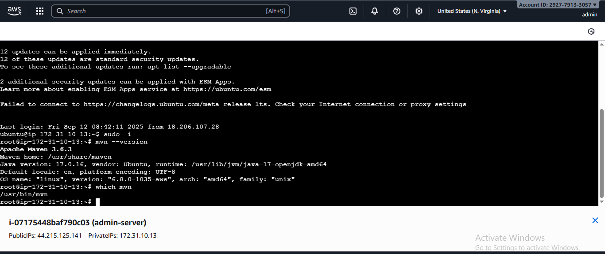
# Setup Kubernetes on Amazon EKS

You can follow same procedure in the official  AWS document [Getting started with Amazon EKS – eksctl](https://docs.aws.amazon.com/eks/latest/userguide/getting-started-eksctl.html)   

#### Pre-requisites: 
- an EC2 Instance 
  - Install AWSCLI latest verison
    ```
    apt install unzip -y
    curl "https://awscli.amazonaws.com/awscli-exe-linux-x86_64.zip" -o "awscliv2.zip"
    unzip awscliv2.zip
    sudo ./aws/install
    ```
  - configure the aws 
    ```commandline
    root@ip-172-31-22-54:~# aws configure
    AWS Access Key ID [None]: xxx
    AWS Secret Access Key [None]: xx
    Default region name [None]: us-east-1
    Default output format [None]: json
    ```

1. Setup kubectl   
   a. Download kubectl version latest 
   b. Grant execution permissions to kubectl executable   
   c. Move kubectl onto /usr/local/bin   
   d. Test that your kubectl installation was successful    

   ```sh 
   curl -LO "https://dl.k8s.io/release/$(curl -L -s https://dl.k8s.io/release/stable.txt)/bin/linux/amd64/kubectl"
   chmod +x ./kubectl
   mv ./kubectl /usr/local/bin 
   kubectl version --client
   ```
2. Setup eksctl   
   a. Download and extract the latest release   
   b. Move the extracted binary to /usr/local/bin   
   c. Test that your eksclt installation was successful   

   ```sh
   curl --silent --location "https://github.com/weaveworks/eksctl/releases/latest/download/eksctl_$(uname -s)_amd64.tar.gz" | tar xz -C /tmp
   sudo mv /tmp/eksctl /usr/local/bin
   eksctl version
   ```
  
3. Create an IAM Role and attache it to EC2 instance    
   `Note: create IAM user with programmatic access if your bootstrap system is outside of AWS`   
   IAM user should have access to   
   IAM   
   EC2   
   CloudFormation  
   Note: Check eksctl documentaiton for [Minimum IAM policies](https://eksctl.io/usage/minimum-iam-policies/)

4.   ### Once IAM role created attach that IAM Role to ec2 instance###
    Actions--> secuity--> Modify IAM Role
   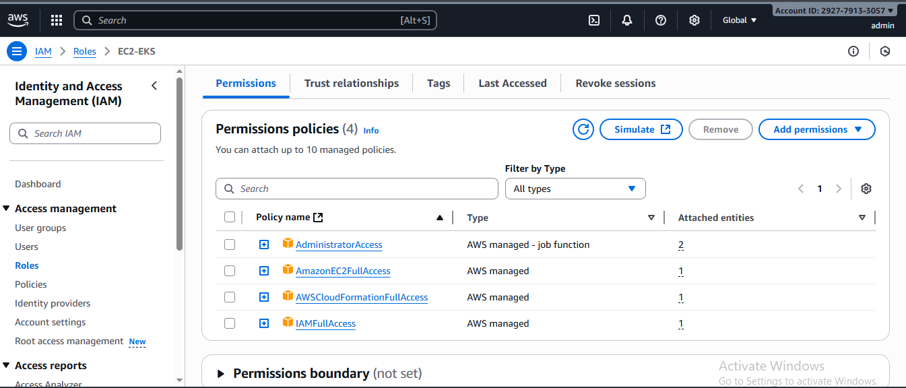

5. Create your cluster and nodes 
   ```sh
   eksctl create cluster --name cluster-name  \
   --region region-name \
   --node-type instance-type \
   --nodes-min 2 \
   --nodes-max 2 \ 
   --zones <AZ-1>,<AZ-2>
   
   example:
   eksctl create cluster --name demo-cluster \
   --region us-east-1 \
   --node-type t2.small \
    ```

6. To delete the EKS clsuter 
   ```sh 
   eksctl delete cluster demo-cluster --region us-east-1 
   ```
   
7. Validate your cluster using by creating by checking nodes and by creating a pod 
   ```sh 
   kubectl get nodes
   kubectl run tomcat --image=tomcat 
   ```
   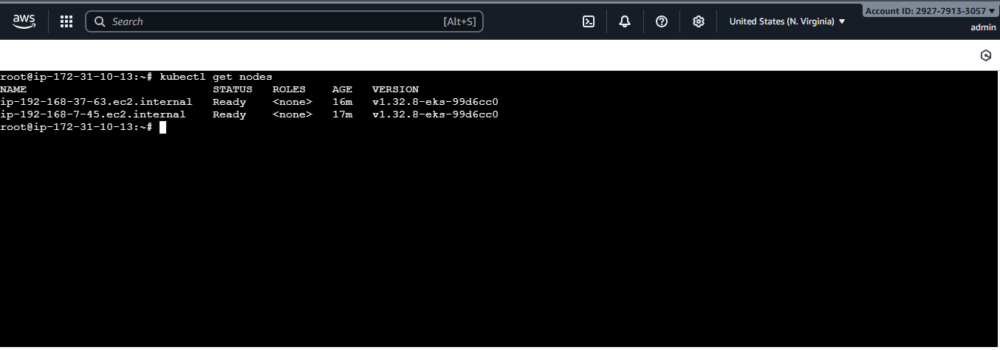
   
   #### Deploying Nginx pods on Kubernetes
1. Deploying Nginx Container
    ```sh
    kubectl create deployment  demo-nginx --image=nginx --replicas=2 --port=80
 
    kubectl get all
    kubectl get pod
   ```

2. Expose the deployment as service. This will create an ELB in front of those 2 containers and allow us to publicly access them.
   ```sh
   kubectl expose deployment demo-nginx --port=80 --type=LoadBalancer
   ```
   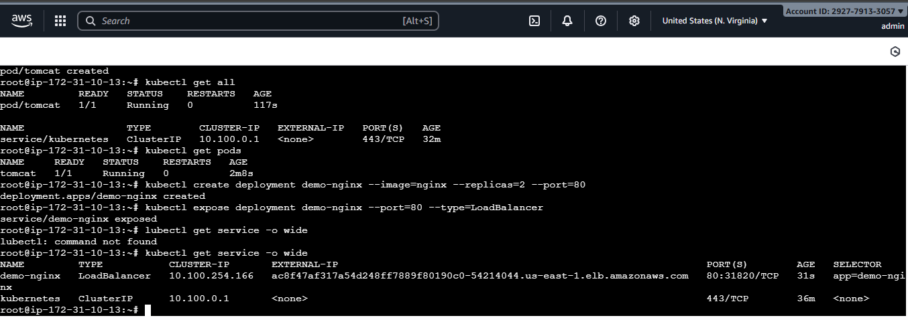

## Sonarqube setup on admin-server

```commandline
adduser sonarqube
sudo apt install fontconfig openjdk-17-jre -y
apt-get install unzip
sudo su - sonarqube
wget https://binaries.sonarsource.com/Distribution/sonarqube/sonarqube-9.4.0.54424.zip
unzip *
chmod -R 755 /home/sonarqube/sonarqube-9.4.0.54424
chown -R sonarqube:sonarqube /home/sonarqube/sonarqube-9.4.0.54424
cd sonarqube-9.4.0.54424/bin/linux-x86-64/
./sonar.sh start
```
### result looks like this
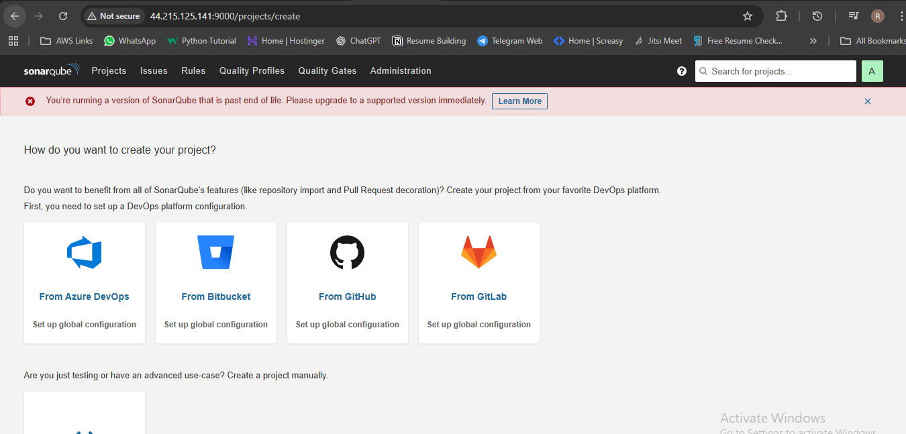

```

u --> admin
P --> admin
```
## Installing Docker on admin server

```commandline
vim docker.sh
```
```commandline
#!/bin/bash
echo << EOF
"=========================================================="
"||     Set up Docker's Apt repository ...............   ||"
"=========================================================="
EOF
#Set up Docker's Apt repository
# Add Docker's official GPG key:
sudo apt-get update -y
sudo apt-get install ca-certificates curl gnupg -y
sudo install -m 0755 -d /etc/apt/keyrings
curl -fsSL https://download.docker.com/linux/ubuntu/gpg | sudo gpg --dearmor -o /etc/apt/keyrings/docker.gpg
sudo chmod a+r /etc/apt/keyrings/docker.gpg

# Add the repository to Apt sources:
echo \
  "deb [arch="$(dpkg --print-architecture)" signed-by=/etc/apt/keyrings/docker.gpg] https://download.docker.com/linux/ubuntu \
  "$(. /etc/os-release && echo "$VERSION_CODENAME")" stable" | \
  sudo tee /etc/apt/sources.list.d/docker.list > /dev/null
sudo apt-get update -y

echo << EOF
"=========================================================="
"||   Docker's Apt repository is completed...........    ||"
"=========================================================="
EOF


echo << EOF
"=========================================================="
"||   Install the Docker packages....................    ||"
"=========================================================="
EOF

sudo apt-get install docker-ce docker-ce-cli containerd.io docker-buildx-plugin docker-compose-plugin -y

echo << EOF
"=========================================================="
"||   Install is completed ....................    ||"
"=========================================================="
EOF

dockerStatus=$(systemctl status docker | awk '/Active/ {print $3}' | tr -d "[()]")
dockerVersion=$(docker -v | awk '/version/ {print $3}' | tr -d ",")

echo "The Docker status is $dockerStatus"
echo "The Docker version is $dockerVersion"
```
```commandline
sh docker.sh 
```
### after docker installtion 
```commandline
usermod -aG docker jenkins
usermod -aG docker ubuntu
systemctl restart docker
```
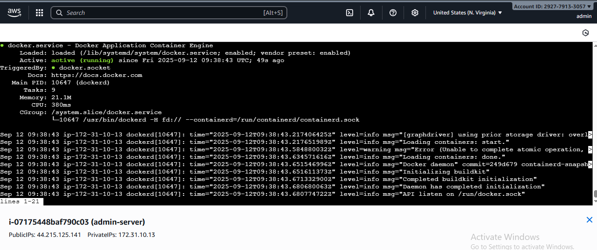
   
## Plugins to install
```commandline
Docker Pipeline
SonarQube Scanner
Eclipse Temurin installer
Pipeline: Stage View

```
## credential setups
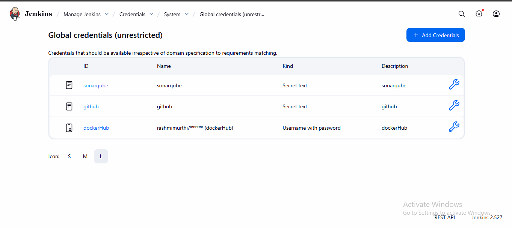


# Installing argocd

You can follow same procedure in the official Argo CD document [Getting started with Argo CD](https://argo-cd.readthedocs.io/en/stable/getting_started/)

1. Create namespace
```
kubectl create namespace argocd
kubectl apply -n argocd -f https://raw.githubusercontent.com/argoproj/argo-cd/stable/manifests/install.yaml
```

2. Expose the service
```sh 
kubectl get svc -n argocd
kubectl patch svc argocd-server -n argocd -p '{"spec": {"type": "LoadBalancer"}}'
```
3. Tunnelining use 
```sh 
kubectl get svc argocd-server -n argocd
```
4. Describe Argo CD Server
```sh 
root@ip-172-31-86-153:~kubectl describe svc argocd-server -n argocd
Name:                     argocd-server
Namespace:                argocd
Labels:                   app.kubernetes.io/component=server
                          app.kubernetes.io/name=argocd-server
                          app.kubernetes.io/part-of=argocd
Annotations:              <none>
Selector:                 app.kubernetes.io/name=argocd-server
Type:                     LoadBalancer
IP Family Policy:         SingleStack
IP Families:              IPv4
IP:                       10.100.128.127
IPs:                      10.100.128.127
LoadBalancer Ingress:     a654b9e7489e74285a6e36068318dbb5-2095593561.us-east-1.elb.amazonaws.com
Port:                     http  80/TCP
TargetPort:               8080/TCP
NodePort:                 http  31854/TCP
Endpoints:                192.168.42.31:8080
Port:                     https  443/TCP
TargetPort:               8080/TCP
NodePort:                 https  31871/TCP
Endpoints:                192.168.42.31:8080
Session Affinity:         None
External Traffic Policy:  Cluster
Internal Traffic Policy:  Cluster
Events:
```
```sh 
root@ip-172-31-86-153:~# kubectl get svc argocd-server -n argocd
NAME            TYPE           CLUSTER-IP       EXTERNAL-IP                                                                     PORT(S)                AGE
argocd-server   LoadBalancer   10.100.128.127 a654b9e7489e74285a6e36068318dbb5-2095593561.us-east-1.elb.amazonaws.com    80:31854/TCP,443:31871/TCP   22m
 
```
5. To access the application 
```sh 
 https://<EXTERNAL-IP> # if LoadBalncer
 <public ip>:31854     # if nodePort
```

6. TO get the secrete key

```sh
kubectl -n argocd get secret argocd-initial-admin-secret -o jsonpath="{.data.password}" | base64 -d
```
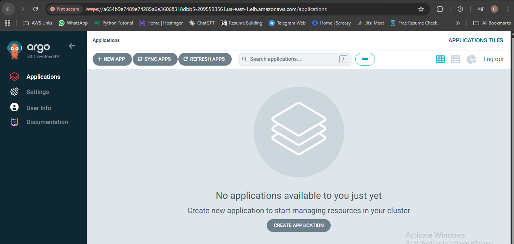

## Email Notification Setup

```commandline

1) gmail setup
 Obtain application specific password
• sing-in to gmail account >> navigate to settings >> privacy and security settings
• setup two step verification settings (because without two step verification we cannot generate application specific password)
• after setting up two step verification setting in gmail account navigate back to security and privacy settings
• click on application specific password >> give the name of the application in the drop down as Jenkins (google by default does not have any specific application password setting for Jenkins) >> this will generate password note down the password generated
Note : Since the Password has a overall control over you gmail account disclosing it may lead serious consequences
2. Setup SMTP configuration for sending the gmail
• navigate in the following path from dashboard after logging in manage Jenkins >> configure system >> scroll down to email notification section
• enter the following parameters
• smtp server : smtp.gmail.com
• default user email suffix : @gmail.com
• select advanced
• check smtp authentication
• username : (Your gmail id)
• password : (application specific password generated from previous step)
• check use SSL
• SMTP port : 465
• Reply to address : noreply@gmail.com(optional)
• Charset : UTF-8 (by default it is UTF-8)
• select Test configuration mail
• Test e-mail recipient : <enter recipient email id >
click on test configuration which will send a test mail to the recipient e-mail id

Also add to Extended E-mail Notification
```

## 📂 Folder Structure

```
.
├── Jenkinsfile
├── pom.xml
├── src/
├── argocd-manifest/
│   └── deployment.yml
├── images/   <-- stored all screenshots here
└── README.md
```
## 🎯 Outcome

After running this pipeline successfully:
- ✅ Code is compiled and tested
- ✅ Static code analysis is done
- ✅ Docker image is built & pushed
- ✅ Deployment file is updated automatically
- ✅ ArgoCD deploys app to Kubernetes cluster
  

---
